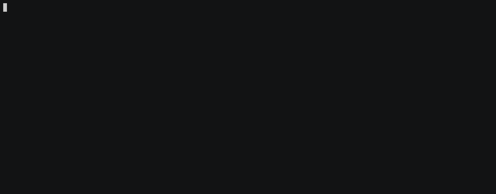

# ldget
[](https://travis-ci.org/ontola/active_response) 
[](http://makeapullrequest.com)

A simple command line interface tool to get RDF items using HTTP GET requests.

[](https://asciinema.org/a/BOc4JjKkTbMOwA2IvnJ7V3uhp)

## When should you use this?

- You need RDF data as Stdout.
- Write bash scripts that use linked data.ldget
- Check triple values from inside your terminal.
- Testing your linked data service.
- Get data from your [Solid](https://github.com/solid/solid) pod.

## Installation

- On MacOS using [homebrew](https://brew.sh/): `$ brew tap ontola/ldget https://github.com/ontola/ldget.git && brew install ontola/ldget/ldget`
- Or install the binaries from the [releases page](https://github.com/ontola/ldget/releases)
- Or build it yourself. Install golang, clone this repo and run `go get ./... && go install` to install the dependencies and add `ldget` to `path`.

## Usage

```
COMMANDS:
     triples, t            Fetch an RDF resource, return the triples. Serialized as N-Triples.
     predicates, p         Fetch an RDF resource, return the predicates.
     objects, o            Fetch an RDF resource, return the objects.
     subjects, s           Fetch an RDF resource, return the subjects.
     predicateObjects, po  Fetch an RDF resource, return the predicate and object values.
     prefixes              Shows your user defined prefixes from  `~/.ldget/prefixes`.
     expand, x             Expands any prefix. `ldget x schema` => https://schema.org/
     help, h               Shows a list of commands or help for one command
```

Use `?s ?p ?o` to filter by `%{subject URL} %{predicate URL} %{object value}`. This is similar to [Triple Pattern Fragments](http://www.hydra-cg.com/spec/latest/triple-pattern-fragments/#bib-hydra-ldf).

If you want to fetch a URL, but do not want to filter by it's subject, you can use the `--resource` flag:

`ldget triples --resource http://example.com/myResourceURL` Returns all triples for that resource as N-Triples.

Use the `.` character as a wildcard. For example, if you want to get all triples for subject `http://example.com/X` with an object value of `"Value"`, use:

`$ ldget triples http://example.com/X . "Value"`

## Prefixes

URLs are awesome, but they are cumbersome to remember and type.
You can specify a set of prefixes in `~/.ldget/prefixes` for mapping URLs to shorthands.

```
schema=http://schema.org/
joep=https://argu.co/argu/u/joep
```

`$ ldget objects joep schema:description`

## Test

- `$ go test`

## Credits

Written by Joep Meindertsma.

Most of the hard work is done by the guys at Knakk, who wrote [this awesome RDF library for Go](https://github.com/knakk/rdf).
